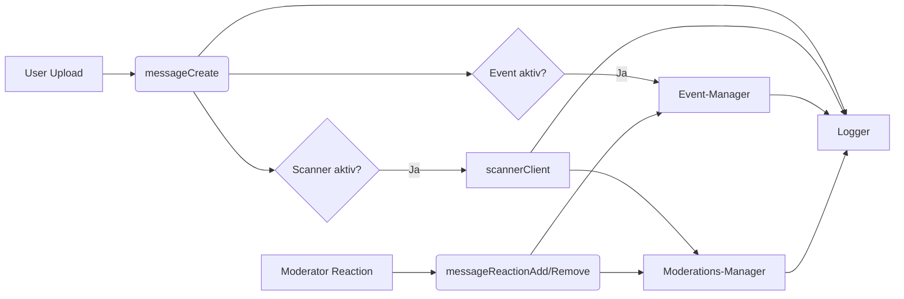

# Agenten- & Rollenhandbuch – PixAI Discord Bot

Dieses Dokument verbindet technische Module mit operativen Rollen. Es soll Entwicklern, Moderatoren und Ownern helfen, Verantwortlichkeiten klar zuzuordnen.

## 1. Technische Agenten

| Agent | Verantwortungsbereich | Relevante Dateien |
|-------|-----------------------|-------------------|
| **Bot-Core** | Startet den Discord-Client, lädt globale/guild-spezifische Configs, initialisiert Module & Health-Check. | `bot/index.js`, `bot/lib/moduleLoader.js`, `bot/events/` |
| **Scanner-Client** | Kommuniziert ausschließlich über HTTP mit dem externen Scanner (Token, Checks, Stats). | `bot/lib/scannerClient.js` |
| **Event-Manager** | Verwalten von Events, Uploads, Votes, Persistenz in JSON. | `bot/lib/eventStore.js`, Daten unter `bot/data/events/` |
| **Moderations-Manager** | Speichert und aktualisiert geflaggte Inhalte, synchronisiert Reaction-Entscheidungen. | `bot/lib/flaggedStore.js`, `bot/modules/community-guard/` |
| **Konfigurations-Manager** | Verwaltet `bot/config/bot-global.json` und `bot/config/guilds/<ID>.json`, merged Defaults & Module. | `bot/lib/botConfig.js`, `bot/modules/tag-scan/commands/scan-config.js` |
| **Logging-Agent** | Konsolidiert Logausgaben (Konsole & Datei). | `bot/lib/logger.js`, `bot/data/logs/bot.log` |

### Zusammenarbeit der Agenten

1. **Bot-Core** lädt Konfiguration via **Konfigurations-Manager**, initialisiert Module, **Scanner-Client**, **Event-Manager** und **Moderations-Manager**.
2. Das Modul **tag-scan** verarbeitet Attachments, ruft den Scanner auf und aktualisiert den **Moderations-Manager**.
3. Das Modul **picture-events** registriert Uploads beim **Event-Manager** und verwaltet Votes über Reaction-Events.
4. Das Modul **community-guard** interpretiert Moderations-Reaktionen auf geflaggte Inhalte und synchronisiert Entscheidungen im **Moderations-Manager**.
5. Alle Schritte protokolliert der **Logging-Agent**.

## 2. Menschliche Rollen

| Rolle | Aufgaben | Rechte/Beschränkungen | Wichtige Commands/Events |
|-------|---------|-----------------------|-------------------------|
| **Bot-Owner** | Technische Verantwortung, Deployment, Konfigurationspflege, Fehleranalyse. | Immer vollen Zugriff (IDs in `bot.bot.owners`). | Zugriff auf alle Commands, pflegt `bot/config/bot-global.json` & Guild-Dateien. |
| **Server-Admins** | Setzen Guild-Konfigurationen, starten/stoppen Events, definieren Schwellenwerte. | Müssen in `adminRoles` stehen oder Discord-`ADMINISTRATOR` besitzen. | `!eventstart`, `!eventstop`, `!eventextend`, `!eventexport`, `!setscan` |
| **Moderatoren** | Überwachen Uploads, reagieren auf Flagged Content, voten in Events. | Rollen aus `modRoles`. | `!eventstatus`, Reaction-Emojis (👍/👎/⚠️/❌) |
| **Normale User** | Teilnehmen an Events, laden Bilder hoch. | Kein Zugriff auf Admin-/Mod-Commands, unterliegen Upload-Limits (`event.maxEntriesPerUser`). | `messageCreate` für Einreichungen, Event-Reaktionen falls erlaubt. |

### Berechtigungsmatrix

- Commands prüfen erst Owner-Status, dann Admin-/Mod-Rollen via `permissions.js`.
- Reaction-Events dürfen nur echte User (keine Bots) auslösen.
- Upload-Limits enforced durch den **Event-Manager**.

## 3. Prozessketten

### 3.1 Upload & Scan

1. User sendet Nachricht mit Attachment.
2. `messageCreate` erkennt scannbaren Inhalt und ruft `scannerClient.scanImage()` auf.
3. Ergebnis wird bewertet (`flagThreshold`/`deleteThreshold`).
4. Bei Überschreitung speichert der **Moderations-Manager** den Fall (`status: flag|delete`).
5. Läuft ein Event, registriert der **Event-Manager** den Upload samt Scan-Metadaten.

### 3.2 Moderationsentscheidung

1. Moderator reagiert mit Emoji (⚠️, ❌ etc.).
2. `messageReactionAdd` mappt Emoji → Aktion.
3. **Event-Manager** aktualisiert Votes (falls Event-Kanal).
4. **Moderations-Manager** aktualisiert Status (Warnung, Löschung) und entfernt ggf. die Nachricht.
5. Entfernt ein Moderator seine Reaktion, setzt `messageReactionRemove` den Status zurück auf `flag` (zur erneuten Prüfung).

### 3.3 Konfigurationsänderung

1. Admin ruft `!scanconfig <flag> <delete>` auf (Alias: `!setscan`).
2. **Konfigurations-Manager** schreibt die neuen Werte in `bot/config/guilds/<GUILD_ID>.json` und aktualisiert den Cache.
3. Der **tag-scan**-Modul-Handler nutzt sofort die neuen Thresholds bei weiteren Uploads.

## 4. Kommunikations- und Datenflüsse

## 5. Governance & Compliance

- **Datensparsamkeit**: Logs und Flagged-Einträge regelmäßig prüfen und archivieren/löschen, sobald Fälle abgeschlossen sind.
- **Zugriffsmanagement**: `bot/config/bot-global.json` sowie `bot/config/guilds/*.json` nur verschlüsselt ablegen; Dateirechte im Deployment einschränken.
- **Vorfallreaktion**: Bei Scanner-Ausfällen werden Attachments protokolliert, aber nicht automatisch gelöscht. Moderation informiert Owner/Admins.
- **Änderungsmanagement**: Neue Features nur über Pull Requests mit aktualisierter Dokumentation (`README.md`, `docs/README.md`, `docs/AGENTS.md`).

## 6. Referenzen

- Legacy-Architektur & zusätzliche Features: `_archived/README.md`, `_archived/DEV-README.md`.
- Aktuelles Entwickler-Howto: [`docs/README.md`](./README.md).

---

Bei Fragen zur Rollenverteilung oder zum technischen Ablauf sollte dieses Dokument zuerst konsultiert werden. Ergänzungen bitte immer in Abstimmung mit Bot-Ownern einpflegen.
